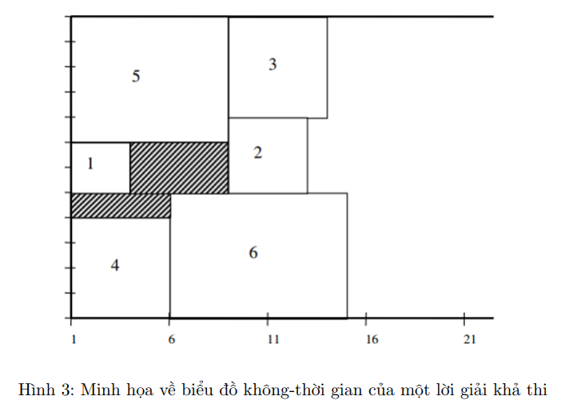
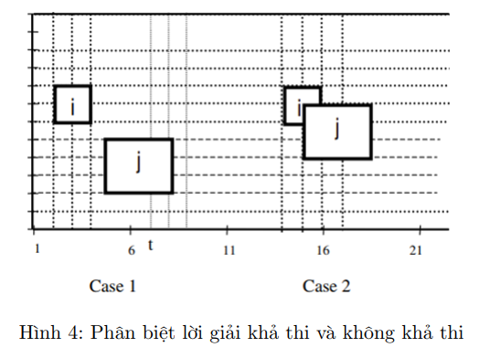

# Xếp lịch cho bến tàu tại Tân Cảng

Bài toán xếp lịch cho bến tàu là bài toán đi tìm một lập lịch thỏa mãn một số ràng buộc về mặt không-thời gian của các tàu với mục tiêu là cực tiểu hóa tổng thời gian dòng chảy có trọng số.

Bài toán phân bổ bến có thể được biểu diễn bằng biểu đồ không - thời gian như Hình 3, trong đó trục hoành và trục tung lần lượt thể hiện các đơn vị thời gian và phần bến. Một tàu có thể được xem như một hình chữ
nhật có chiều dài là thời gian xử lý **pi** và chiều cao là kích thước tàu **si**. Ta gọi tàu i đang neo đậu tại đoạn bến vi tại thời điểm ui, và khi đó tàu chiếm các đoạn bến liên tiếp giữa **vi** và **vi + si − 1** và từ đơn vị thời gian ui đến **ui + pi − 1**

    

Hình 4 mô tả rõ hơn một cách trực quan giữa 2 trường hợp cho quyết định phân bổ tài nguyên không-thời gian cho tàu i và tàu j: (Case 1) là một đề xuất khả thi trong thực tế còn (Case 2) là không khả thi.

    

Chi tiết các ràng buộc và hàm mục tiêu cho BTL này có thể tìm thấy trong thư mục infor.
